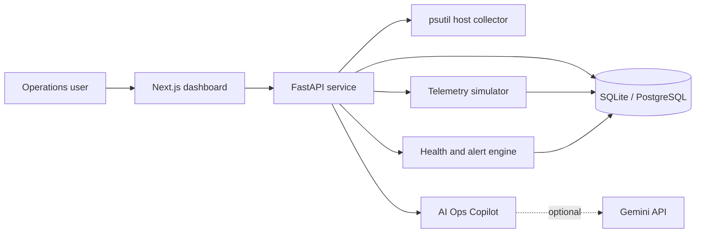

# AI System Health Guardian Monitoring Platform

An enterprise-style operations platform for monitoring AI infrastructure, data centers, and blockchain mining sites. Guardian combines real host telemetry, simulated multi-site operations, incident response, data quality, security posture, asset/vendor management, reporting, and an AI operations copilot in one recruiter-ready project.

## Why this project matters

Modern compute estates fail across layers: hardware, cooling, power, networks, telemetry pipelines, access controls, and vendor handoffs. Guardian presents those layers as one coherent operating picture and demonstrates practical platform engineering skills: observability, APIs, data pipelines, incident management, operational security, documentation, and AI-assisted support.

## Highlights

- Real host CPU, memory, disk, network, process, uptime, and load metrics via `psutil`
- Four UAE compute/mining sites, 40 rigs, 20 assets, five vendors, and realistic telemetry
- Ten-second background simulator with changing thermal, hashrate, power, and latency signals
- Weighted health score with explanations and recommended actions
- Threshold alerts, incident ownership, resolution workflow, SLA-ready timestamps, and MTTR data
- ETL run history and quality dimensions: completeness, freshness, validity, duplicates, and errors
- Role-based demo authentication, audit logs, vulnerability findings, and API key inventory
- Gemini-powered copilot when configured, with a deterministic data-grounded fallback
- CSV report exports, Docker deployment, API docs, tests, and operational playbooks

## Technology

Next.js 15, TypeScript, Tailwind CSS, Recharts, FastAPI, SQLAlchemy 2, SQLite/PostgreSQL, Pydantic, psutil, APScheduler, JWT, Docker Compose.

## Architecture



## Local setup

Prerequisites: Python 3.11+, Node.js 20+, npm.

### Backend

```bash
cd ai-system-health-guardian/backend
python -m venv .venv
# Windows
.venv\Scripts\activate
pip install -r requirements.txt
uvicorn app.main:app --reload
```

The database is created and seeded automatically. API: `http://localhost:8000`; interactive documentation: `http://localhost:8000/docs`.

### Frontend

```bash
cd ai-system-health-guardian/frontend
copy .env.example .env.local
npm install
npm run dev
```

Open `http://localhost:3000`.

### Docker

```bash
cd ai-system-health-guardian
docker compose up --build
```

### Vercel

The repository contains two deployable Vercel projects:

- `backend/`: FastAPI serverless function
- `frontend/`: Next.js dashboard

Deploy the backend first, then set the frontend environment variable
`NEXT_PUBLIC_API_URL` to the backend production URL before deploying the
frontend.

On Vercel, SQLite uses the function's temporary filesystem and the in-process
telemetry scheduler is disabled. This makes the hosted version suitable as a
portfolio demonstration; use PostgreSQL and an external scheduler for durable
production telemetry.

## Demo credentials

| Role | Email | Password |
|---|---|---|
| Admin | admin@example.com | admin123 |
| Tech Specialist | engineer@example.com | engineer123 |
| Viewer | viewer@example.com | viewer123 |

The authentication API is implemented at `POST /api/auth/login`. The current demo UI is intentionally accessible without a login gate so recruiters can explore it immediately.

## Important API endpoints

| Area | Endpoints |
|---|---|
| Overview | `GET /api/overview`, `GET /api/health` |
| Host | `GET /api/system/current`, `/history`, `/processes` |
| Sites | `GET /api/sites`, `/{id}`, `/{id}/metrics`, `/{id}/rigs` |
| Operations | `GET /api/alerts`, `GET/POST /api/incidents`, `PATCH /api/incidents/{id}/resolve` |
| Data | `GET/POST /api/data-pipelines`, `GET /api/data-quality` |
| Copilot | `POST /api/copilot/ask` |
| Governance | `GET /api/assets`, `/vendors`, `/security`, `/notifications` |
| Reports | `GET /api/reports/{sites|incidents|alerts|assets|pipelines}.csv` |

## Five-minute recruiter demo

1. Open Overview and explain the combined operational health score.
2. Trigger a demo incident and show the live alert/incident impact.
3. Drill into Legacy Site to inspect thermal and rig telemetry.
4. Run the telemetry pipeline and explain its quality gates.
5. Ask the Copilot “What should I check first?” and export an incident CSV.

See [docs/RECRUITER_DEMO_SCRIPT.md](docs/RECRUITER_DEMO_SCRIPT.md) for a complete talk track.

## Screenshots

Add repository screenshots here after launching locally:

- Executive command center
- Site detail and telemetry
- Incident board
- AI Ops Copilot
- Cybersecurity posture

## Configuration

- `DATABASE_URL`: defaults to SQLite; set a PostgreSQL SQLAlchemy URL for production-style persistence.
- `JWT_SECRET`: signing secret for demo access tokens.
- `GEMINI_API_KEY`: optional. Without it, the copilot remains fully functional with deterministic operational logic.
- `NEXT_PUBLIC_API_URL`: browser-facing FastAPI URL.

## Testing

```bash
cd backend
pytest
cd ../frontend
npm run build
```

## Current limitations and future improvements

This is a production-style portfolio system, not a production deployment. Authentication tokens are issued but the UI route guard is not enforced; notification delivery is simulated; the map is a visual placeholder; telemetry is locally simulated; and SQLite is the default. Natural next steps are OIDC/SSO, RBAC middleware, Prometheus/OpenTelemetry ingestion, real webhook workers, WebSockets, PostGIS mapping, encrypted secrets, PostgreSQL/TimescaleDB, and Kubernetes manifests.
